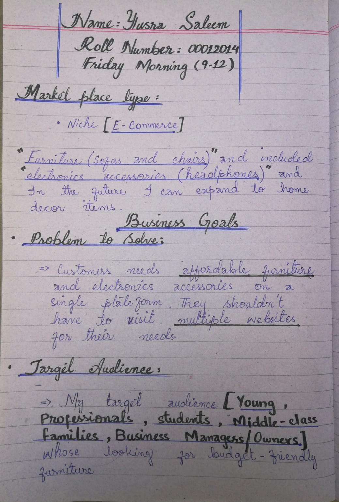
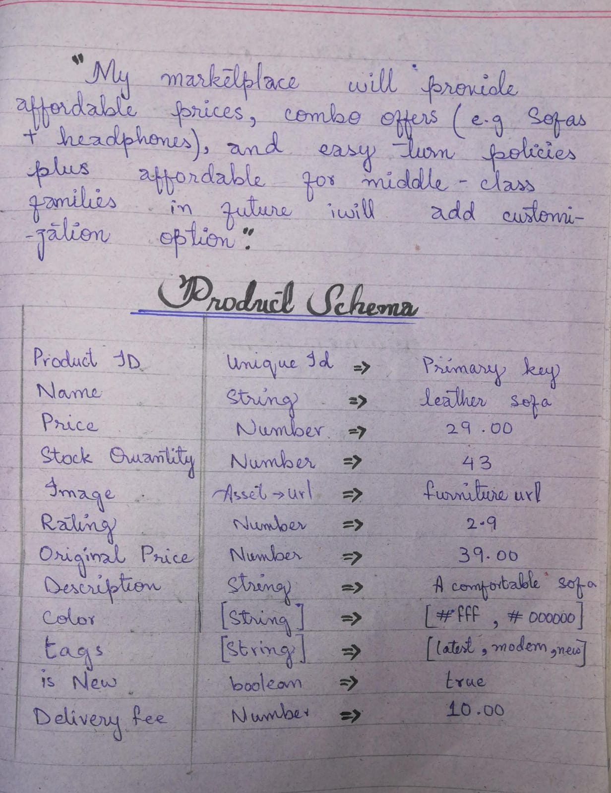
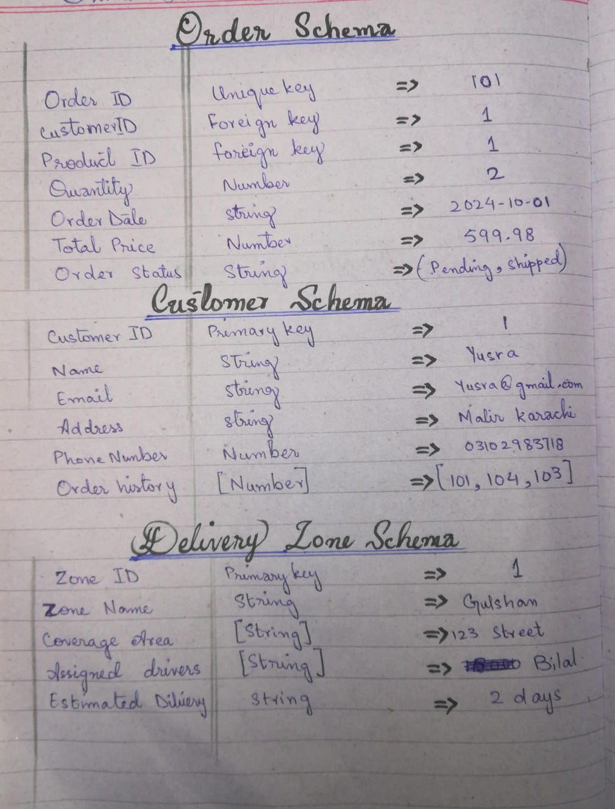
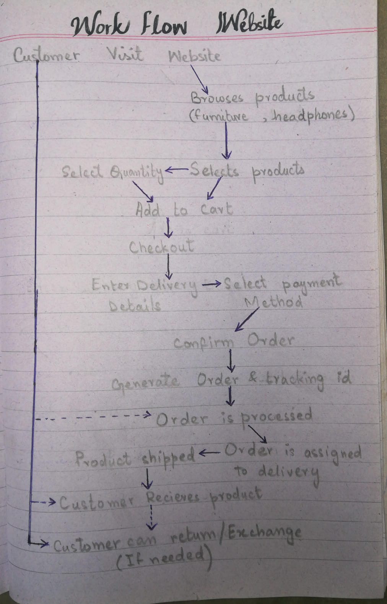

# Marketplace Builder Hackathon 2025 - Day 1 Work

Welcome to my **Day 1** submission for the **Marketplace Builder Hackathon 2025**! This repository contains my work for laying the foundation of my e-commerce marketplace, which focuses on **affordable furniture (sofas and chairs)** and **electronics accessories (headphones)**.

---
## **Download the PDF**
For a detailed overview of my Day 1 work with  **PENCIL AND PAEPR IN DETAIL** , download the PDF here:  
[Download PDF](./pdf24_merged%20(1).pdf)

## **Project Overview**
- **Marketplace Type:** Niche E-Commerce
- **Focus Areas:** Furniture (Sofas, Chairs) and Electronics Accessories (Headphones)
- **Unique Selling Points (USP):**
  - Affordable prices
  - Customization options for furniture
  - Combo deals (e.g., Sofa + Headphones)
  - Fast and reliable delivery

---

## **Business Goals**
Here are the key goals for my marketplace:
1. **Problem to Solve:** Provide customers with affordable furniture and electronics accessories on a single platform.
2. **Target Audience:** Young professionals, students, and middle-class families.
3. **Products/Services:** Sofas, chairs, and headphones (with plans to expand to home decor items).
4. **Unique Features:** Customization options, combo deals, and easy return policies.

---

## **Workflow**
Here’s the workflow for my marketplace:

### **Customer Visit**
- **Browses products** (Furniture, headphones)

### **Select Quantity**
- **Selects products**
  - Add to Cart
  - Checkout

### **Enter Delivery Details**
- **Select payment method**

### **Confirm Order**
- **Generate Order & Tracking ID**

### **Order is Processed**
- **Product shipped**
  - Order is assigned to delivery

### **Customer Receives Product**
- **Customer can return/exchange** (if needed)

---

## **Data Schema**
The data schema defines the structure of my marketplace. It includes the following tables:

### **Products Table**
| Field               | Type        | Example           |
|---------------------|-------------|-------------------|
| Product ID          | Unique ID   | 1                 |
| Name                | String      | Leather Sofa      |
| Price               | Number      | 299.00            |
| Discounted Price    | Number      | 249.00            |
| Stock Quantity      | Number      | 10                |
| Image               | Asset URL   | image_url         |
| Description         | String      | A comfortable sofa|
| Tags                | String [ ]  | [Leather, Medium] |
| Free Delivery       | Boolean     | True              |
| Colors              | String [ ]  | [Black, Brown]    |

### **Customers Table**
| Field               | Type        | Example           |
|---------------------|-------------|-------------------|
| Customer ID         | Primary Key | 1                 |
| Name                | String      | John Doe          |
| Email               | String      | john@gmail.com    |
| Address             | String      | 123 Main St       |
| Phone Number        | Number      | 03001234567       |
| Order History       | String [ ]  | [101, 102]        |

### **Orders Table**
| Field               | Type        | Example           |
|---------------------|-------------|-------------------|
| Order ID            | Primary Key | 101               |
| Customer ID         | Foreign Key | 1                 |
| Product ID          | Foreign Key | 1                 |
| Quantity            | Number      | 2                 |
| Order Value         | String      | 299.00 x 2        |
| Total Price         | Number      | 598.00            |
| Order Status        | String      | Pending           |

### **Delivery Zones Table**
| Field               | Type        | Example           |
|---------------------|-------------|-------------------|
| Zone ID             | Primary Key | 1                 |
| Zone Name           | String      | Gulshan           |
| Area Coverage       | String      | 123 Street        |
| Assigned Drivers    | String [ ]  | [Driver1, Driver2]|
| Estimated Delivery  | String      | 2 days            |

---

---

## **Woek Flow chart**
The flowchart visualizes the connections between them:

